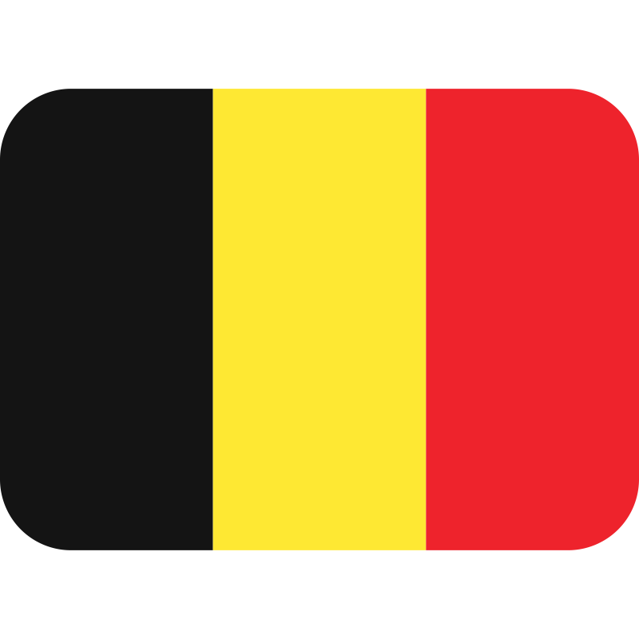
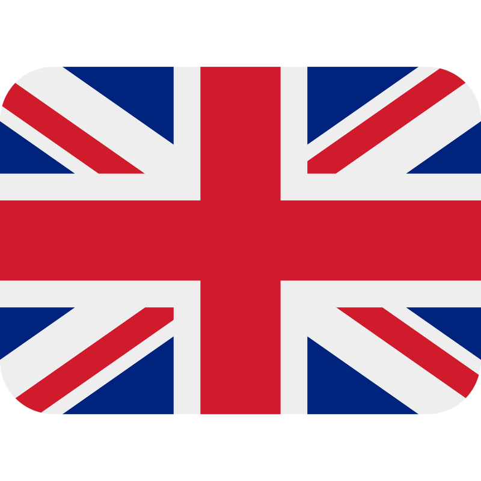

<h1>  Lallement Corentin </h1>

<h2>🔭 About Me</h2>

🚀 Tech Lover & Coding Fanatic 🚀
 Always learning, always coding!
 

🎯 Mission: Making Cool Stuff 🎯
 From college to real world, I make sleek software!
 

💡 Lots of Interests, One Goal 💡
 Web, AI, you name it—I'm all about making things awesome!

---

<h3>Skills</h3>

---
<h3>Languages</h3>

