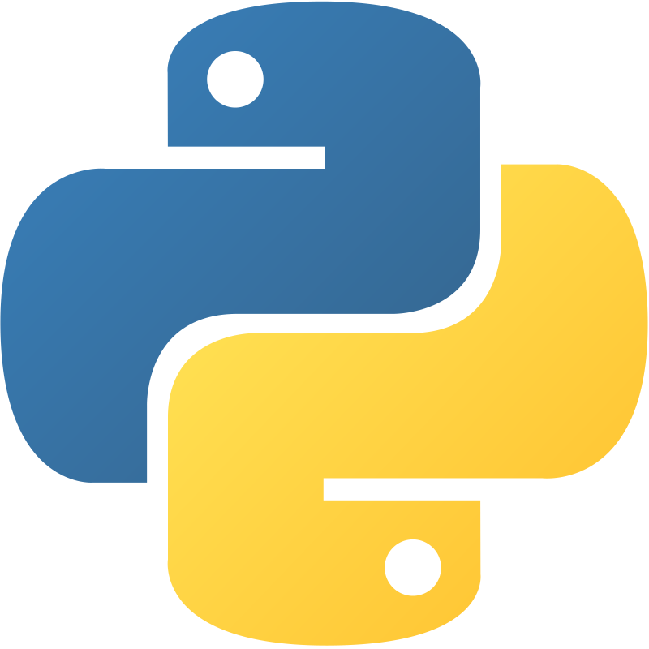

	
	
	

</a>
<h1 align="center"> Lallement Corentin  <code><i>< CorentinL5 /></i></code></h1>

<h2 align="center"> 🔭 A Guy From Belgium  </h2>

	<h3>📜 About Me</h3>
	<ul type="none">
		<li>🔭 I’m currently working on <a href="https://github.com/CorentinL5/PyThonBotproject">PyThonBotproject</a></li>
		<li>🌱 I’m currently learning <strong>UML, Python, HTML, CSS, Telecom</strong></li>
		<li>📫 How to reach me <strong>corentinlallement5+contact-github@gmail.com</strong></li>
		<li>⚡ Fun fact <strong>First, solve the problem. Then, write the code.</strong></li>
	</ul>

<h3>🤔 Want to know more about me?</h3>

<ul type="none">
	<li>
		  
		  
		  
		  
		  
	</li>
	<li>
		 
	</li> 
	<li>
		
		
		
	</li>
	<li></li>
</ul>

<h3>Skills</h3>
<h4>Web Development</h4>

 <h4>Programming Languages</h4>

 <h4>Mores</h4>

 <h4>My Editors</h4>

<h3>Languages</h3>

<h2>Support</h2>

  

<h6>© 2024 Corentin LALLEMENT</h6>

