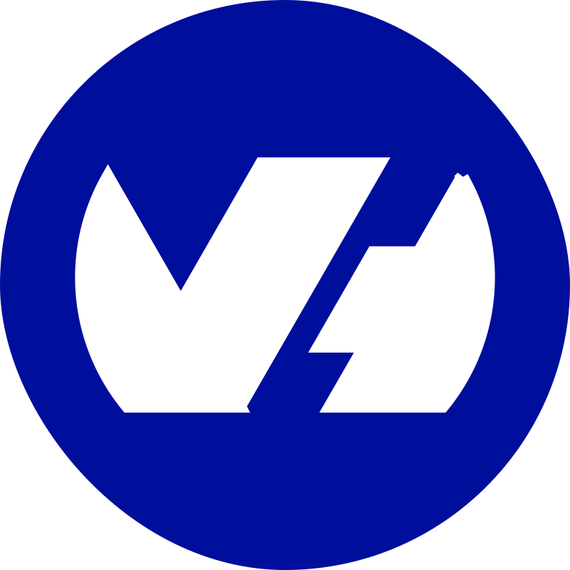
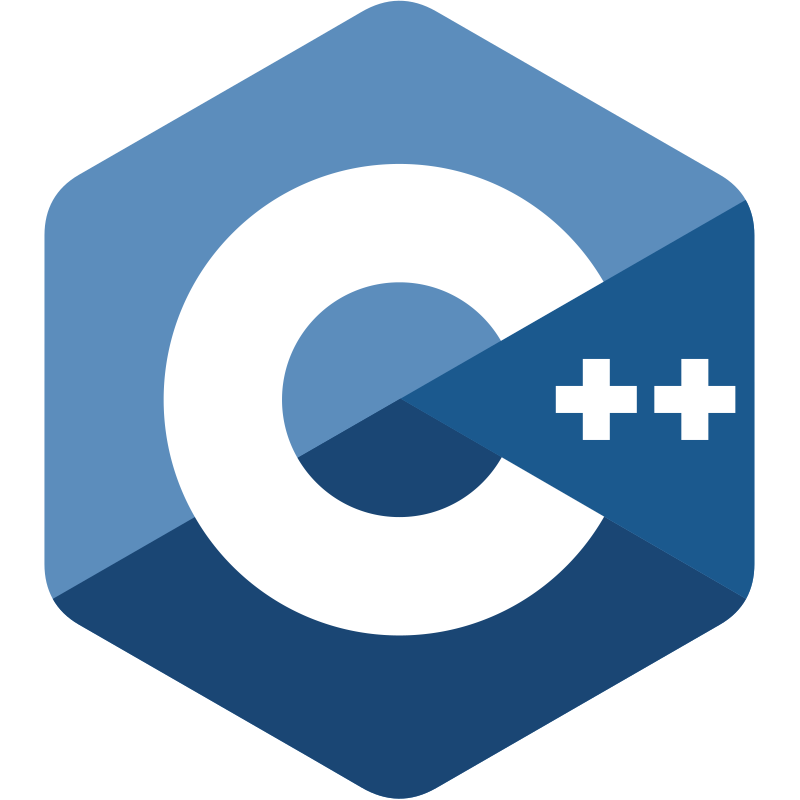
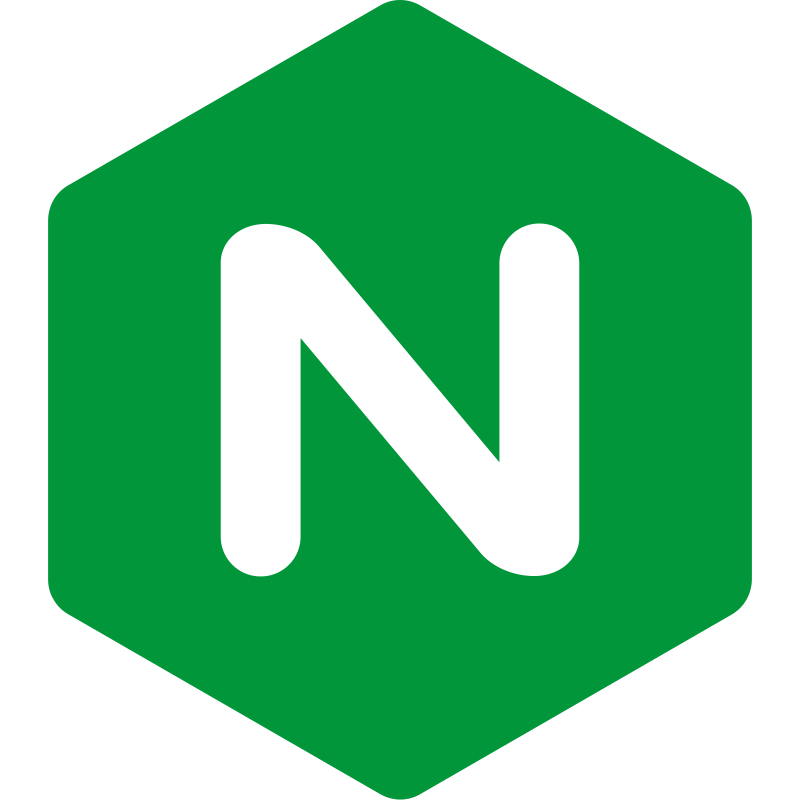

 

	
	
	
	

	<h1> 
		Lallement Corentin 
		 <code><i><CorentinL5/></i></code>
		 <code><i><Tarumo/></i></code>
	</h1>
	
 
		🔭 A Guy From Belgium 
	

## 📜 About Me

- 🔭 I’m currently working on **[WebSite-project-DevWEB-HEHB1Q2](https://github.com/CorentinL5/WebSite-project-DevWEB-HEHB1Q2)**
- 🌱 I’m currently learning **UML, Python, HTML, CSS, Telecom**
- 📫 How to reach me **[My mail](mailto:corentinlallement5+contact-github@gmail.com)**
- ⚡ Fun fact **First, solve the problem. Then, write the code**

## 🌐 Socials

## 📊 Github Stats

## 🏆 Skills

<table>
    <thead>
        <tr >
            <th width="20%"></th>
            <th width="40%">Languages</th>
            <th width="40%">Tools</th>
        </tr>
    </thead>
    <tbody>
        <tr>
            <td>
				
				
				
				
				
			</td>
            <td align="center">
				
				
				
				
			</td>
            <td align="center">
				
				
			</td>
        </tr>
        <tr>
            <td>
				
				
				
				
				
			</td>
            <td align="center">
				
			</td>
            <td align="center">
				
				
				
			</td>
        </tr>
        <tr>
            <td>
				
				
				
				
				
			</td>
            <td align="center">
			</td>
            <td align="center">
				
				
				
				
				
			</td>
        </tr>
        <tr>
            <td>
				
				
				
				
				
			</td>
            <td align="center">
				
				
			</td>
            <td align="center">
				
				
				
				
			</td>
        </tr>
        <tr>
            <td>
				
				
				
				
				
			</td>
            <td align="center">
				
			</td>
            <td align="center">
				
				
				
				
				
				
				
				
			</td>
        </tr>
        <tr>
            <td>
				
				
				
				
				
				*
			</td>
            <td align="center">
				
				
				
				
				
				
			</td>
            <td align="center">
				
				
				
				
				
				
				
				
				
				</td>
        </tr>
    </tbody>
</table>
<h6 align="right">* Known but never used...</h6>

<table>
	<tr>
		<th width="50%">My Editors</th>
		<th width="50%">Languages</th>
	</tr>
	<tr>
		<td align="center">
			
			
			
			
			
		</td>
		<td align="center">
			
			
			
		</td>	
	</tr>
</table>

	

 

	

   

<h5>© 2024 Corentin LALLEMENT</h5>

  

